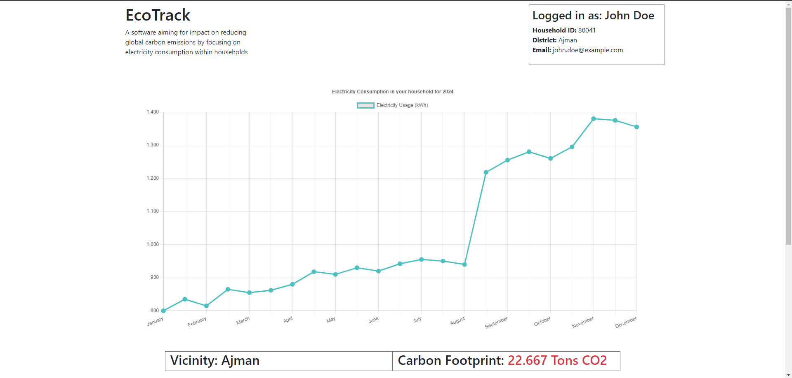

# EcoTrack  
A software aiming for impact on reducing global carbon emissions by focusing on electricity consumption within households

## Getting Started

### Dependencies

- `flask` (+ `flask_cors`)
- Supported OS: Windows

### Installing

Provide step-by-step instructions on how to get a development environment running.

- Clone the repository
```bash
git clone https://github.com/osam7a/ecotrack
cd ecotrack
```
- Install the required dependencies
```bash
pip install -r requirements.txt
```
- Run the main file
```bash
python3 main.py
```
- On a different terminal, run the following
```bash
ngrok.exe http 3333
```

(For any inquiries, here is my contact info)

**Name:** Osama Alhennawi

**Email:** osamaziadalhinawi@gmail.com

**Number:** +971 55 403 2302